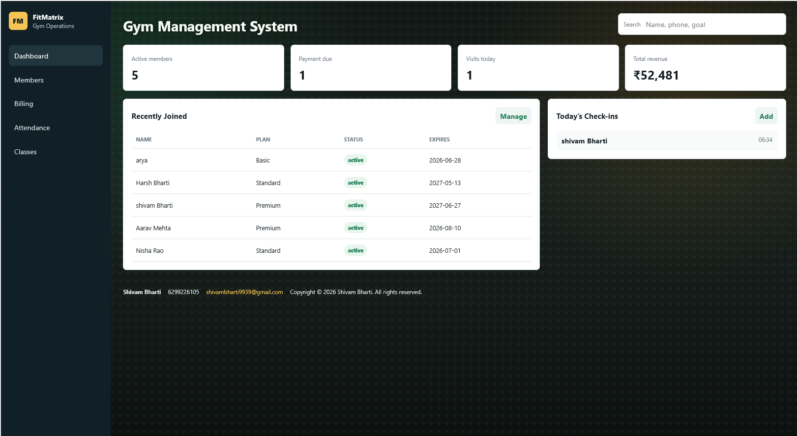
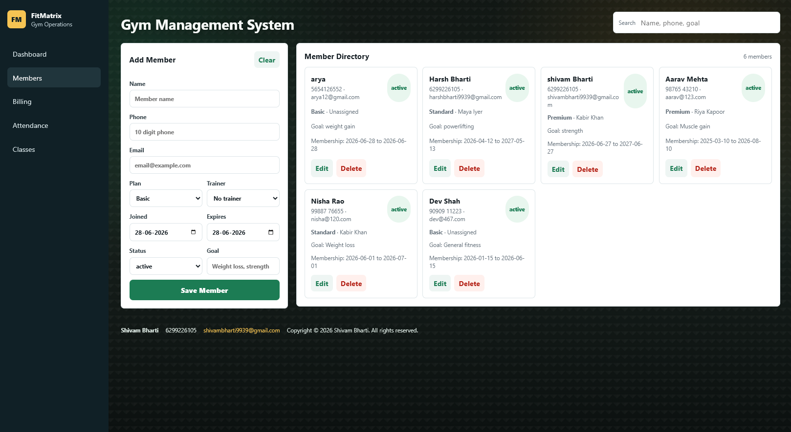
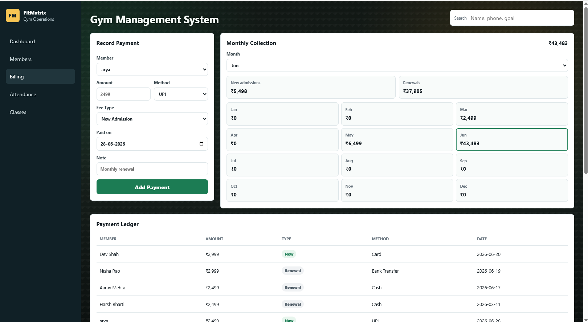
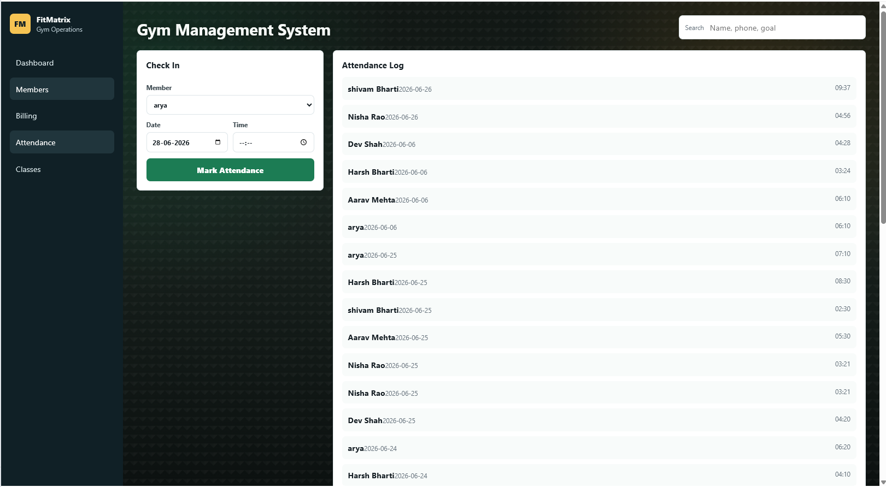
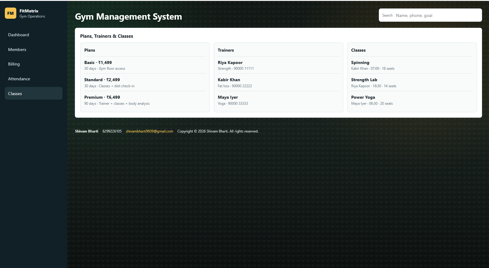

# Gym Management System

A modern Gym Management System built with **Node.js**, **Express.js**, and **Vanilla JavaScript**. The application helps streamline daily gym operations by providing an intuitive interface for managing members, memberships, trainers, attendance, payments, and class schedules.

## Features

* Interactive dashboard with key business metrics
* Member management (Add, Edit, Delete, Search)
* Membership plan assignment
* Trainer assignment
* Payment and billing management
* Attendance tracking
* Trainer management
* Class scheduling
* Revenue overview
* Data persistence using a local JSON database

## Tech Stack

* Node.js
* Express.js
* HTML5
* CSS3
* JavaScript (ES6)
* JSON Database

## Project Structure

```text
Gym-Management-System/
│
├── data/
│   └── db.json
├── public/
│   ├── app.js
│   ├── index.html
│   └── styles.css
├── package.json
├── server.js
├── run.bat
└── README.md
```

## Installation

### 1. Clone the repository

```bash
git clone https://github.com/YOUR_USERNAME/Gym-Management-System.git
```

### 2. Navigate to the project

```bash
cd Gym-Management-System
```

### 3. Install dependencies

```bash
npm install
```

### 4. Start the application

```bash
node server.js
```

Alternatively, on Windows you can simply run:

```text
run.bat
```

### 5. Open in your browser

Visit:

```text
http://localhost:3000
```

If your application is configured to use a different port, replace **3000** with the appropriate port.

## Screenshots

### Dashboard



### Member Management



### Billing & Payments



### Attendance Tracking



### Classes & Trainers



## Future Improvements

* User authentication and role-based access
* Database integration (MongoDB/MySQL/PostgreSQL)
* Reports and analytics
* Email and SMS notifications
* Cloud deployment
* Responsive mobile interface

## License

This project is intended for educational and portfolio purposes.
